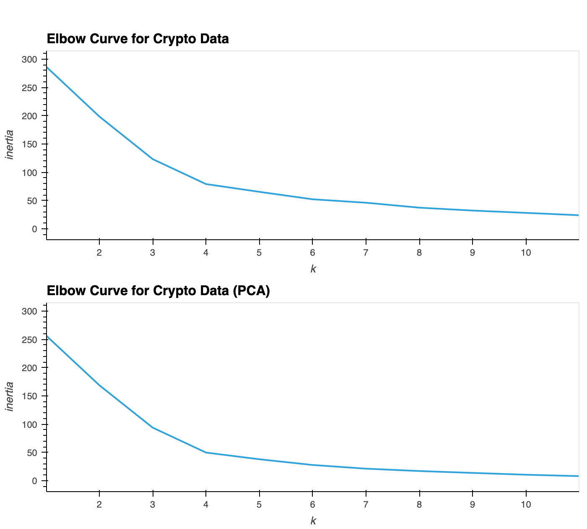
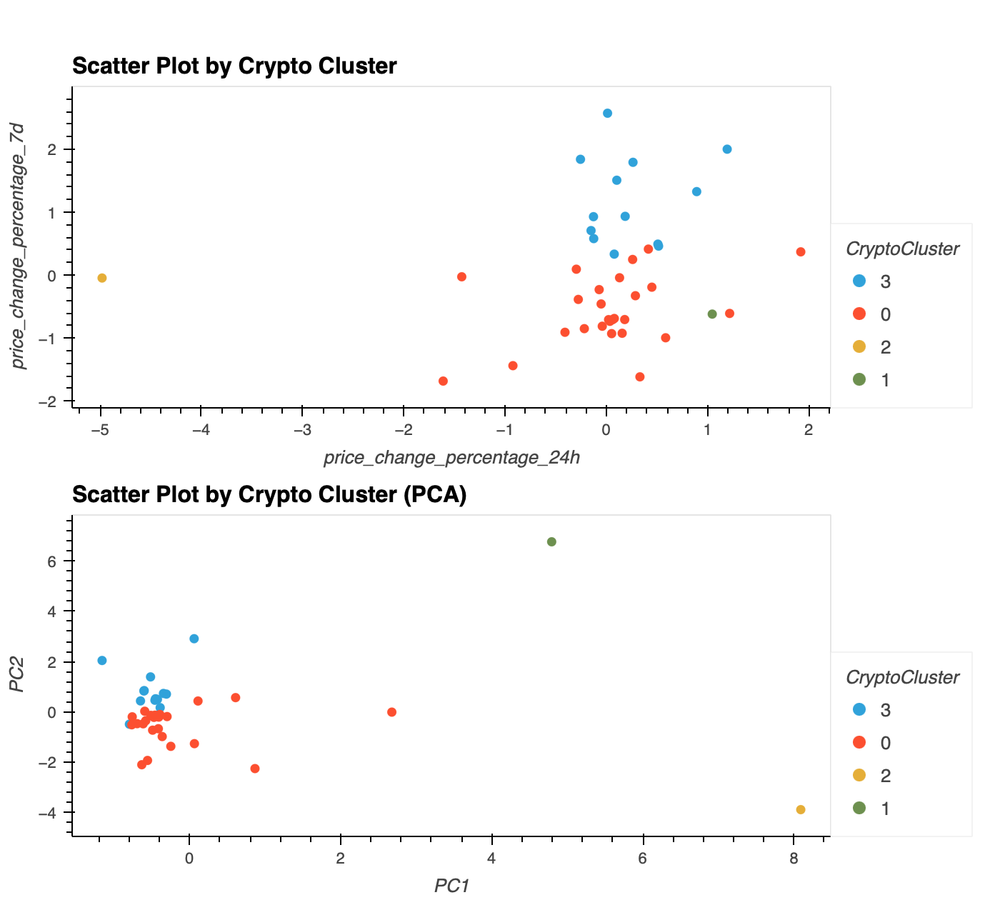

# CryptoClustering
Cryptocurrency Price Change Prediction: Unsupervised Learning

## Contents
1. [Overview](#1-overview)
2. [Repository, Setup and Execution](#2-repository-setup-and-execution)
3. [Data Source](#3-data-source)

## 1. Overview

This challenge focuses on predicting whether cryptocurrencies are influenced by 24-hour or 7-day price changes using Python and unsupervised learning. The prediction process is conducted twice: first, using the original data, and second, using Principal Components Analysis (PCA) data. The results are then compared to determine the optimal approach for unsupervised learning.

## 2. Repository, Setup and Execution

### This repository contains:
- [`Crypto_Clustering.ipynb`](Crypto_Clustering.ipynb): a Jupyter notebook that contains all the necessary codes.
- [`resources/`](resources): folder containing the data files used

### To start: 
- Clone this GitHub repository to a local folder.
- Run `Crypto_Clustering.ipynb` on Jupyter notebook.

### Required Python Libraries:
- pandas
- hvplot
- scikit-learn

## Data Analysis

After visually analysing the cluster analysis results, it is found that the optimal k value using original data and the PCA data are the same, although the inertia value is smaller when using PCA data.

The scatter plots suggest that clear and distinct clusters can be found when using original data as well as PCA data. This shows that patterns can still be found even the number of features is reduced. The advantage of using PCA data is that resources for processing is reduced without sacrificing accuracy.

## 4. Data Source
Data for this dataset was generated by edX Boot Camps LLC, and is intended for educational purposes only.
